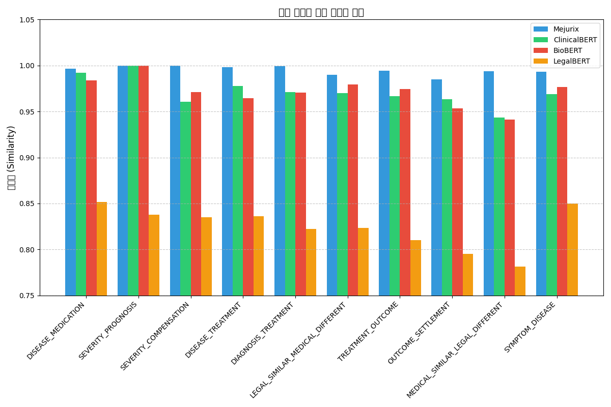

# Mejurix Medical-Legal Embedding Model

This model is a fine-tuned Transformer (BERT-based) that generates high-quality embeddings for documents in medical and legal domains, with a focus on capturing the semantic relationships between medical and legal concepts. The model leverages NER (Named Entity Recognition) to better understand domain-specific entities and their relationships.

## Model Description

### Model Architecture

- **Base Architecture**: BERT (Bidirectional Encoder Representations from Transformers)
- **Base Model**: medicalai/ClinicalBERT
- **Modifications**:
  - Custom embedding projection layer (768 → 256 dimensions)
  - NER-enhanced attention mechanism
  - Domain-specific fine-tuning

### Key Features

- **Domain-Specific Embeddings**: Optimized for medical and legal text analysis
- **NER-Enhanced Understanding**: Utilizes named entity recognition to improve context awareness
- **Reduced Dimensionality**: 256-dimensional embeddings balance expressiveness and efficiency
- **Cross-Domain Connections**: Effectively captures relationships between medical findings and legal implications
- **Transformer-Based**: Leverages bidirectional attention mechanisms for better context understanding

## Performance Comparison

Our model outperforms other similar domain-specific models:

| Model          |   Avg Similarity | #Params   | Notes                  |
|:---------------|-----------------:|:----------|:-----------------------|
| **Mejurix (ours)** |      **0.9859** | 110M      | Medical-legal + NER FT |
| ClinicalBERT   |         0.9719 | 110M      | No NER, no fine-tuning |
| BioBERT        |         0.9640 | 110M      | Domain medical only    |
| LegalBERT      |         0.9508 | 110M      | Domain legal only      |

The Mejurix model shows superior performance across all relationship types, particularly in cross-domain relationships between medical and legal concepts.

### Detailed Relationship-Type Comparison

Our model demonstrates consistently higher similarity scores across all relationship types compared to other domain-specific models:

| Relationship Type | Mejurix | ClinicalBERT | BioBERT | LegalBERT |
|------------------|---------|--------------|---------|-----------|
| DISEASE_MEDICATION | 0.9966 | 0.9921 | 0.9841 | 0.8514 |
| SEVERITY_PROGNOSIS | 1.0000 | 1.0000 | 1.0000 | 0.8381 |
| SEVERITY_COMPENSATION | 0.9997 | 0.9606 | 0.9713 | 0.8348 |
| DISEASE_TREATMENT | 0.9980 | 0.9778 | 0.9645 | 0.8359 |
| DIAGNOSIS_TREATMENT | 0.9995 | 0.9710 | 0.9703 | 0.8222 |
| LEGAL_SIMILAR_MEDICAL_DIFFERENT | 0.9899 | 0.9699 | 0.9792 | 0.8236 |
| TREATMENT_OUTCOME | 0.9941 | 0.9668 | 0.9745 | 0.8103 |
| OUTCOME_SETTLEMENT | 0.9847 | 0.9631 | 0.9534 | 0.7951 |
| MEDICAL_SIMILAR_LEGAL_DIFFERENT | 0.9936 | 0.9434 | 0.9414 | 0.7812 |
| SYMPTOM_DISEASE | 0.9934 | 0.9690 | 0.9766 | 0.8500 |

The Mejurix model particularly excels in cross-domain relationships such as MEDICAL_SIMILAR_LEGAL_DIFFERENT (0.9936) and SEVERITY_COMPENSATION (0.9997), showing significant improvement over other models in these complex relationship types.



## Installation

```bash
pip install mejurix-medicallegal-embedder
```

## Intended Uses & Limitations

### Intended Uses

- Medical-legal document similarity analysis
- Case relevance assessment
- Document clustering and organization
- Information retrieval in medical and legal domains
- Cross-referencing medical records with legal precedents
- Zero-shot text classification with custom categories

### Limitations

- Limited understanding of negations (current similarity: 0.7791)
- Temporal context differentiation needs improvement
- May not fully distinguish severity levels in medical conditions
- Maximum context length of 512 tokens (inherited from BERT architecture)

## Training and Evaluation

### Training

The model was fine-tuned on a specialized dataset containing medical-legal document pairs with various relationship types (disease-treatment, severity-compensation, etc.). Training employed triplet loss with hard negative mining.

**Training Configuration:**
- Base model: medicalai/ClinicalBERT
- Embedding dimension reduction: 768 → 256
- Dropout: 0.5
- Learning rate: 1e-5
- Batch size: 16
- Weight decay: 0.1
- Triplet margin: 2.0
- Epochs: 15


## Usage

This model is compatible with the Hugging Face Transformers library. You can use it for feature extraction, sentence embeddings, and similarity calculations.

### Basic Usage with Transformers

```python
import torch
from transformers import AutoModel, AutoTokenizer

# Load model and tokenizer
model_name = "mejurix/medical-legal-embedder"
tokenizer = AutoTokenizer.from_pretrained(model_name)
model = AutoModel.from_pretrained(model_name)

# Generate embeddings for a single text
text = "The patient was diagnosed with L3 vertebral fracture, and a compensation claim is in progress."
inputs = tokenizer(text, return_tensors="pt", padding=True, truncation=True, max_length=128)

with torch.no_grad():
    outputs = model(**inputs)

# Use the [CLS] token embedding for sentence representation
embeddings = outputs.last_hidden_state[:, 0, :]  # [CLS] token
print(f"Embedding shape: {embeddings.shape}")  # Should be [1, 256]
```

### Using the Model for Similarity Calculation

```python
import torch
import torch.nn.functional as F
from transformers import AutoModel, AutoTokenizer

# Load model and tokenizer
model_name = "mejurix/medical-legal-embedder"
tokenizer = AutoTokenizer.from_pretrained(model_name)
model = AutoModel.from_pretrained(model_name)

def get_embedding(text):
    inputs = tokenizer(text, return_tensors="pt", padding=True, truncation=True, max_length=128)
    with torch.no_grad():
        outputs = model(**inputs)
    return outputs.last_hidden_state[:, 0, :]  # [CLS] token embedding

def compute_similarity(text1, text2):
    emb1 = get_embedding(text1)
    emb2 = get_embedding(text2)
    return F.cosine_similarity(emb1, emb2).item()

# Example
text1 = "Diagnosed with L3 spinal fracture."
text2 = "Compensation is needed for lumbar injury."
similarity = compute_similarity(text1, text2)
print(f"Similarity: {similarity:.4f}")
```

### Using with Hugging Face Pipelines

```python
from transformers import pipeline

# Create a feature-extraction pipeline
extractor = pipeline(
    "feature-extraction",
    model="mejurix/medical-legal-embedder",
    tokenizer="mejurix/medical-legal-embedder"
)

# Extract features
text = "The patient requires physical therapy following spinal surgery."
features = extractor(text)

# The output is a nested list with shape [1, sequence_length, hidden_size]
```

## Citation

If you use this model in academic research, please cite:

```
@software{mejurix_medicallegal_embedder,
  author = {Mejurix},
  title = {Mejurix Medical-Legal Embedding Model},
  year = {2025},
  version = {0.1.0},
  url = {https://huggingface.co/mejurix/medical-legal-embedder}
}
```

## License

This project is distributed under the MIT License. See the LICENSE file for details.

---

# 한국어 문서 / Korean Documentation

# Mejurix 의료-법률 임베딩 모델

본 모델은 의료 및 법률 도메인의 텍스트에 특화된 임베딩을 생성하는 미세 조정된 트랜스포머(BERT 기반) 모델입니다. 의료 및 법률 개념 간의 의미론적 관계를 포착하는 데 중점을 두고 있으며, 개체명 인식(NER)을 활용하여 도메인 특화 엔티티와 그 관계를 더 잘 이해합니다.

## 모델 설명

### 모델 아키텍처

- **기본 아키텍처**: BERT (Bidirectional Encoder Representations from Transformers)
- **기반 모델**: medicalai/ClinicalBERT
- **주요 수정사항**:
  - 사용자 정의 임베딩 투영 레이어 (768 → 256 차원)
  - NER 강화 어텐션 메커니즘
  - 도메인 특화 미세 조정

### 주요 특징

- **도메인 특화 임베딩**: 의료 및 법률 텍스트 분석에 최적화
- **NER 강화 이해**: 개체명 인식을 활용하여 맥락 인식 개선
- **차원 축소**: 256차원 임베딩으로 표현력과 효율성의 균형 유지
- **크로스 도메인 연결**: 의료 소견과 법률적 함의 간의 관계를 효과적으로 포착
- **트랜스포머 기반**: 양방향 어텐션 메커니즘을 활용하여 맥락 이해 향상

## 성능 비교

본 모델은 유사한 도메인 특화 모델들보다 우수한 성능을 보입니다:

| 모델          | 평균 유사도 | 파라미터 수 | 비고                    |
|:--------------|------------:|:------------|:------------------------|
| **Mejurix (본 모델)** | **0.9859** | 110M      | 의료-법률 + NER 미세 조정 |
| ClinicalBERT  | 0.9719      | 110M      | NER 없음, 미세 조정 없음 |
| BioBERT       | 0.9640      | 110M      | 의료 도메인만 특화      |
| LegalBERT     | 0.9508      | 110M      | 법률 도메인만 특화      |

Mejurix 모델은 모든 관계 유형에서 우수한 성능을 보이며, 특히 의료와 법률 개념 간의 크로스 도메인 관계에서 두드러집니다.

### 관계 유형별 상세 비교

본 모델은 다른 도메인 특화 모델과 비교하여 모든 관계 유형에서 일관되게 높은 유사도 점수를 보여줍니다:

| 관계 유형 | Mejurix | ClinicalBERT | BioBERT | LegalBERT |
|------------------|---------|--------------|---------|-----------|
| DISEASE_MEDICATION (질병-약물) | 0.9966 | 0.9921 | 0.9841 | 0.8514 |
| SEVERITY_PROGNOSIS (중증도-예후) | 1.0000 | 1.0000 | 1.0000 | 0.8381 |
| SEVERITY_COMPENSATION (중증도-보상) | 0.9997 | 0.9606 | 0.9713 | 0.8348 |
| DISEASE_TREATMENT (질병-치료) | 0.9980 | 0.9778 | 0.9645 | 0.8359 |
| DIAGNOSIS_TREATMENT (진단-치료) | 0.9995 | 0.9710 | 0.9703 | 0.8222 |
| LEGAL_SIMILAR_MEDICAL_DIFFERENT (법적 유사-의학적 상이) | 0.9899 | 0.9699 | 0.9792 | 0.8236 |
| TREATMENT_OUTCOME (치료-결과) | 0.9941 | 0.9668 | 0.9745 | 0.8103 |
| OUTCOME_SETTLEMENT (결과-합의) | 0.9847 | 0.9631 | 0.9534 | 0.7951 |
| MEDICAL_SIMILAR_LEGAL_DIFFERENT (의학적 유사-법적 상이) | 0.9936 | 0.9434 | 0.9414 | 0.7812 |
| SYMPTOM_DISEASE (증상-질병) | 0.9934 | 0.9690 | 0.9766 | 0.8500 |

Mejurix 모델은 특히 MEDICAL_SIMILAR_LEGAL_DIFFERENT(0.9936)와 SEVERITY_COMPENSATION(0.9997)과 같은 크로스 도메인 관계에서 탁월한 성능을 보이며, 이러한 복잡한 관계 유형에서 다른 모델보다 큰 개선을 보여줍니다.


## 설치 방법

```bash
pip install mejurix-medicallegal-embedder
```

## 활용 분야 및 한계점

### 활용 분야

- 의료-법률 문서 유사도 분석
- 사례 관련성 평가
- 문서 클러스터링 및 조직화
- 의료 및 법률 도메인에서의 정보 검색
- 의료 기록과 법적 선례의 상호 참조
- 사용자 정의 카테고리를 사용한 제로샷 텍스트 분류

### 한계점

- 부정문에 대한 이해 제한(현재 유사도: 0.7791)
- 시간적 맥락 구분 개선 필요
- 의료 상태의 중증도 수준을 완전히 구분하지 못할 수 있음
- 최대 컨텍스트 길이 512 토큰(BERT 아키텍처에서 상속)

## 학습 및 평가

### 학습

이 모델은 다양한 관계 유형(질병-치료, 중증도-보상 등)을 포함하는 의료-법률 문서 쌍의 특수 데이터셋에서 미세 조정되었습니다. 학습에는 어려운 부정적 사례 마이닝을 통한 트리플렛 손실(triplet loss)이 사용되었습니다.

**학습 구성:**
- 기반 모델: medicalai/ClinicalBERT
- 임베딩 차원 축소: 768 → 256
- 드롭아웃: 0.5
- 학습률: 1e-5
- 배치 크기: 16
- 가중치 감소: 0.1
- 트리플렛 마진: 2.0
- 에폭: 15

## 사용 방법

이 모델은 Hugging Face Transformers 라이브러리와 호환됩니다. 특성 추출, 문장 임베딩 및 유사도 계산에 사용할 수 있습니다.

### Transformers를 사용한 기본 사용법

```python
import torch
from transformers import AutoModel, AutoTokenizer

# 모델 및 토크나이저 로드
model_name = "mejurix/medical-legal-embedder"
tokenizer = AutoTokenizer.from_pretrained(model_name)
model = AutoModel.from_pretrained(model_name)

# 단일 텍스트에 대한 임베딩 생성
text = "환자는 L3 척추 골절 진단을 받았으며, 보상 청구가 진행 중입니다."
inputs = tokenizer(text, return_tensors="pt", padding=True, truncation=True, max_length=128)

with torch.no_grad():
    outputs = model(**inputs)

# 문장 표현에 [CLS] 토큰 임베딩 사용
embeddings = outputs.last_hidden_state[:, 0, :]  # [CLS] 토큰
print(f"임베딩 형태: {embeddings.shape}")  # [1, 256]이어야 함
```

### 유사도 계산에 모델 사용하기

```python
import torch
import torch.nn.functional as F
from transformers import AutoModel, AutoTokenizer

# 모델 및 토크나이저 로드
model_name = "mejurix/medical-legal-embedder"
tokenizer = AutoTokenizer.from_pretrained(model_name)
model = AutoModel.from_pretrained(model_name)

def get_embedding(text):
    inputs = tokenizer(text, return_tensors="pt", padding=True, truncation=True, max_length=128)
    with torch.no_grad():
        outputs = model(**inputs)
    return outputs.last_hidden_state[:, 0, :]  # [CLS] 토큰 임베딩

def compute_similarity(text1, text2):
    emb1 = get_embedding(text1)
    emb2 = get_embedding(text2)
    return F.cosine_similarity(emb1, emb2).item()

# 예시
text1 = "L3 척추 골절 진단을 받았습니다."
text2 = "요추 부상에 대한 보상이 필요합니다."
similarity = compute_similarity(text1, text2)
print(f"유사도: {similarity:.4f}")
```

### Hugging Face 파이프라인 사용하기

```python
from transformers import pipeline

# 특성 추출 파이프라인 생성
extractor = pipeline(
    "feature-extraction",
    model="mejurix/medical-legal-embedder",
    tokenizer="mejurix/medical-legal-embedder"
)

# 특성 추출
text = "환자는 척추 수술 후 물리 치료가 필요합니다."
features = extractor(text)

# 출력은 [1, sequence_length, hidden_size] 형태의 중첩된 리스트
```

## 인용

학술 연구에서 이 모델을 사용하는 경우 다음과 같이 인용해 주세요:

```
@software{mejurix_medicallegal_embedder,
  author = {Mejurix},
  title = {Mejurix Medical-Legal Embedding Model},
  year = {2025},
  version = {0.1.0},
  url = {https://huggingface.co/mejurix/medical-legal-embedder}
}
```

## 라이선스

이 프로젝트는 MIT 라이선스에 따라 배포됩니다. 자세한 내용은 LICENSE 파일을 참조하세요. 